# Gaussian Splat Evaluation & Simulation Environment

An exploration into capturing real-world environments and assets via modern 3D reconstruction tecniques: **Gaussian Splatting + NeRF** and converting them into high-fidelity 3D meshes

## Live Demo
[View the Interactive 3D Viewer](https://michaelnguyenz229.github.io/gaussian-splatting-eval/)

## Tech Stack
* **Capture:** Luma AI (Neural Radiance Fields / Gaussian Splatting)
* **Rendering:** Three.js / WebGL / lil-gui
* **Format:** GLB (Binary glTF) - Optimized for web performance and simulation compatibility.

##  Scans & Assets Gallery

## The Capture & Reconstruction Pipeline

To successfully transition real-world objects into simulation-ready assets, it is critical to understand the underlying data acquisition and neural rendering pipeline. This project utilizes Luma AI, which leverages a combination of **Structure from Motion (SfM)**, **3D Gaussian Splatting (3DGS)**, and **Neural Radiance Fields (NeRFs)**. 

Here is the step-by-step breakdown of the capture and training process used for the assets in this repository:

### 1. Spatial Anchoring & Bounding Volume Initialization
**The Process:** The capture begins by setting two opposing center points (180 degrees apart) around the target object to establish spatial origin and scale. A preliminary 3D bounding box is generated, which is then manually adjusted to tightly enclose the object. 
**The Science:** This step is crucial for computational efficiency; it defines the region of interest (ROI), instructing the algorithm where to concentrate the highest density of rendering primitives and ignore background noise.

| Spatial Boundary View 1 | Spatial Boundary View 2 |
| :---: | :---: |
| 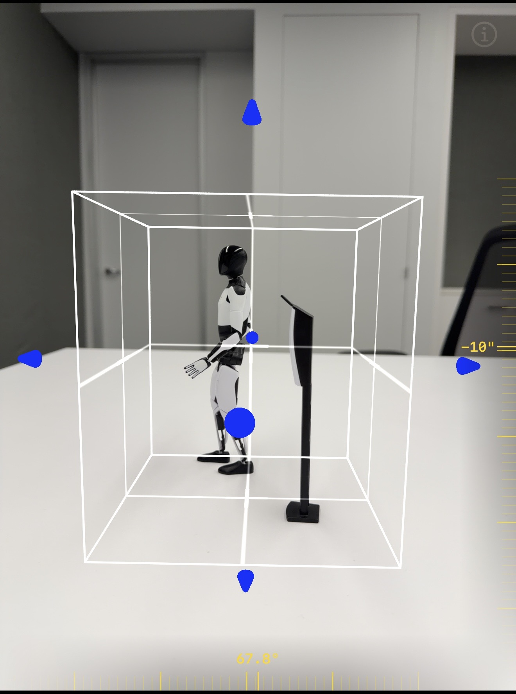 | 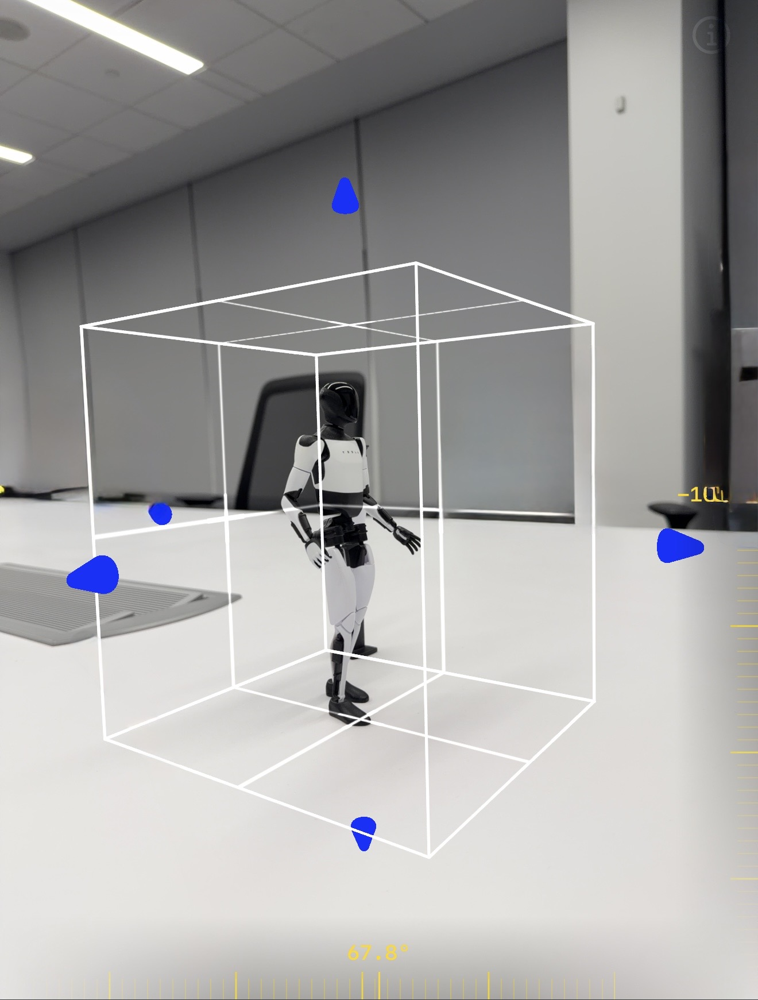 |
| *Defining first center point.* | *Closing the 180° boundary.* |

### 2. Multi-Elevation Image Acquisition (Camera Pose Estimation)
**The Process:** Data collection is guided by three virtual rings (low, middle, and high elevations) surrounding the object. I follow these paths to capture overlapping video frames.
**The Science:** This structured capture guarantees sufficient parallax and overlap. The overlapping 2D frames are fed into a Structure from Motion (SfM) algorithm, which identifies matching feature points across the images to calculate the exact 3D position and orientation (camera pose) of the phone for every single frame.

| Guided Capture - View 1 | Guided Capture - View 2 |
| :---: | :---: |
| 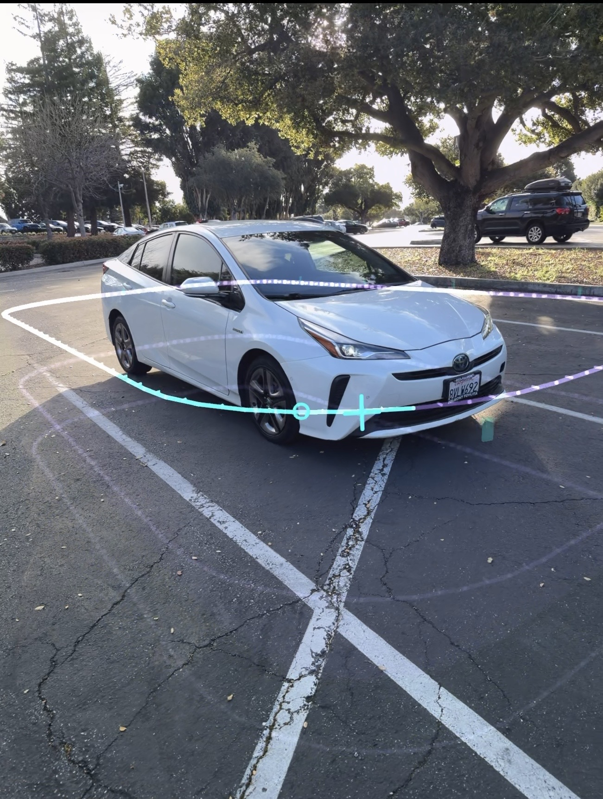 | 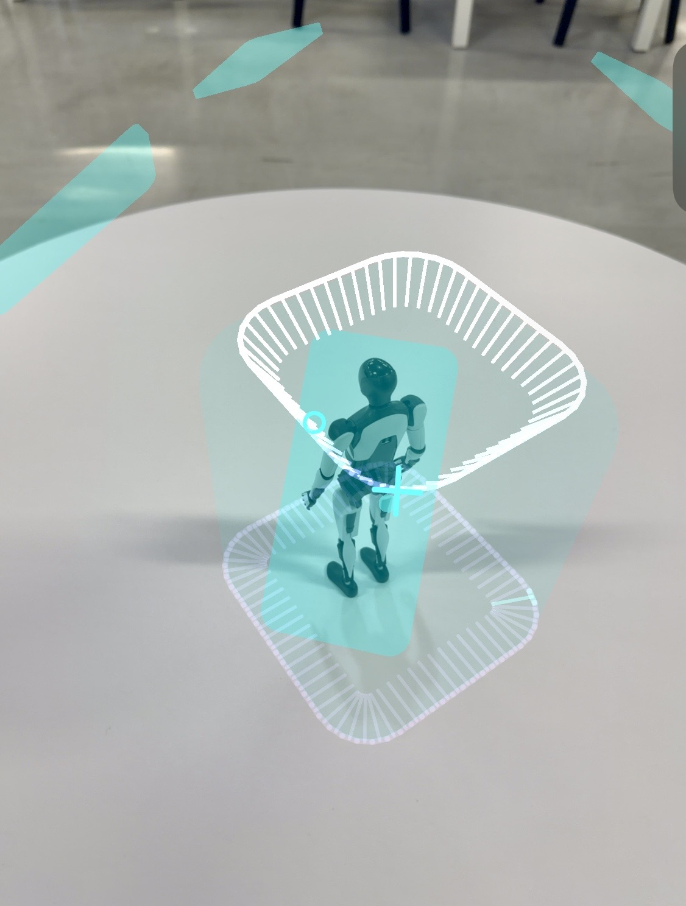 |
| *Following virtual rings to ensure adequate parallax.* | *Multi-elevation orbits for complete surface coverage.* |

### 3. Cloud Compute: Training 3DGS & NeRF
**The Process:** The 2D data and camera poses are uploaded to the cloud, moving through distinct "Training Gaussian Splatting" and "Training NeRF" phases.
**The Science:** The sparse point cloud is initialized into millions of 3D Gaussians (ellipsoids). The network optimizes each Gaussian's position, covariance (scale and stretch), opacity, and color to match the original 2D images. Luma uses NeRF-based techniques in tandem to refine complex lighting and extract a watertight surface mesh from the volumetric data.

### 4. The Splat Rasterization Reveal (Optimization Gradient)
**The Process:** Upon completion, the asset forms visually: sparse point clouds expand into colored ellipses, which then merge into a solid, photorealistic 3D object.
**The Science:** This is a visual representation of the continuous optimization process. As opacity and covariance matrix values are refined by the loss function, the discrete points expand into overlapping ellipsoids, blending seamlessly to recreate the continuous surfaces of the physical environment.

| Asset | 1. Sparse Point Cloud | 2. Gaussian Ellipses | 3. Final Optimized Mesh |
| :--- | :---: | :---: | :---: |
| **OctoTest** | 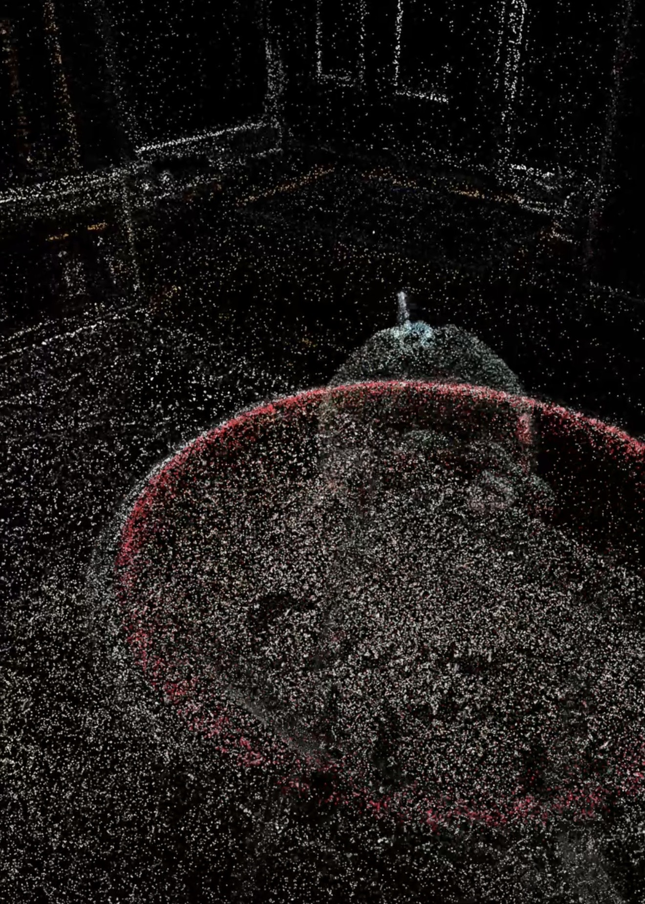 | 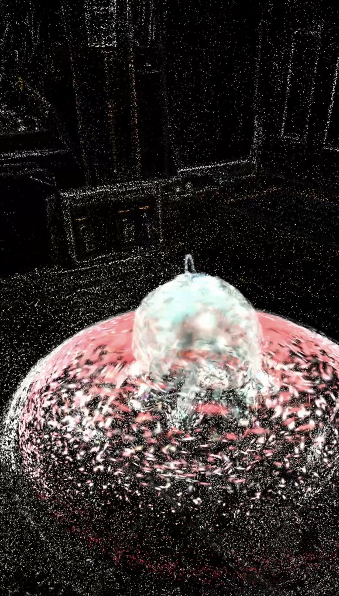 | 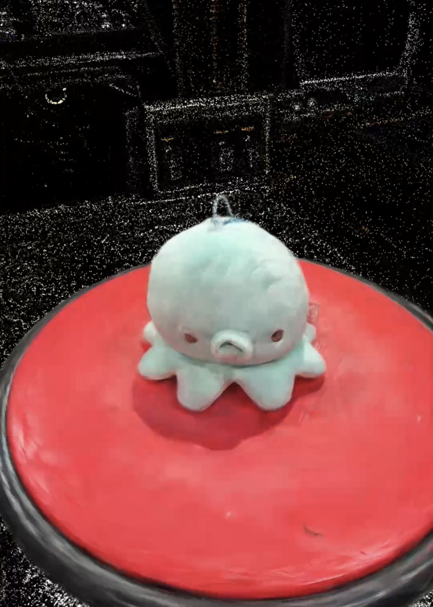 |
| **2019 Prius XLE** | 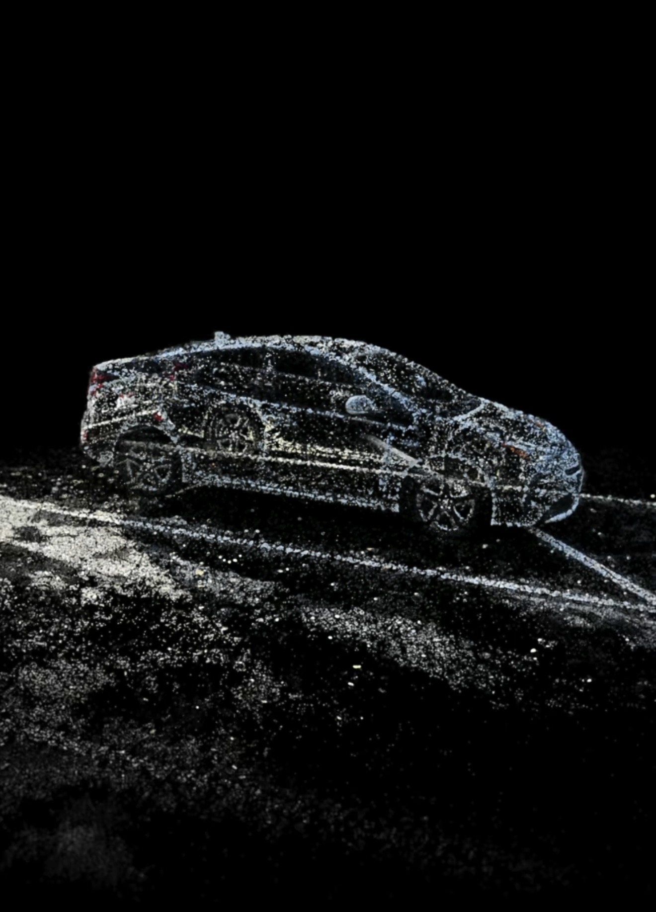 | 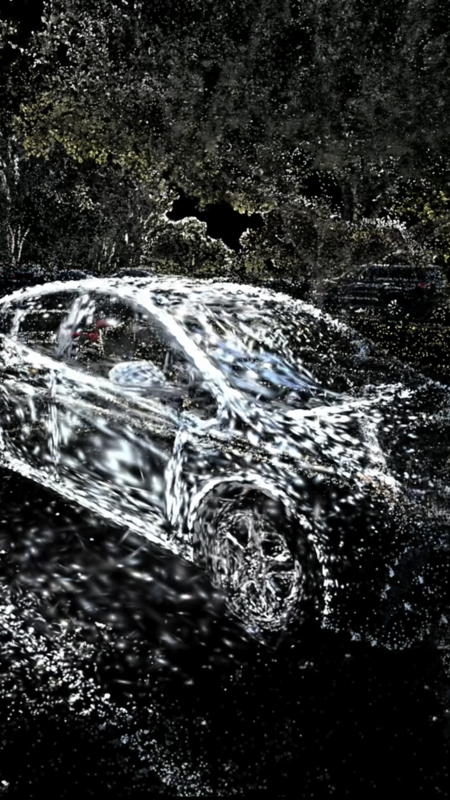 | 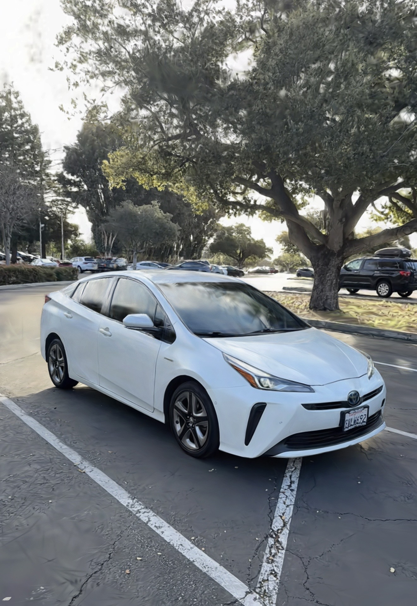 |
| **Tesla Optimus** | 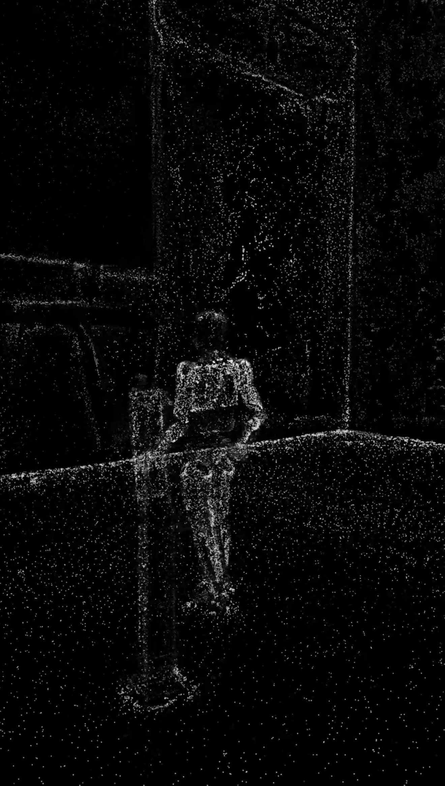 | 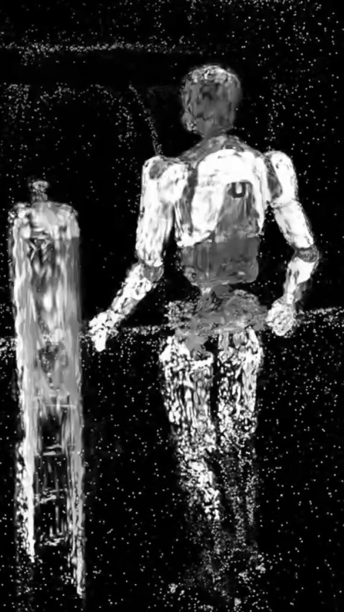 | 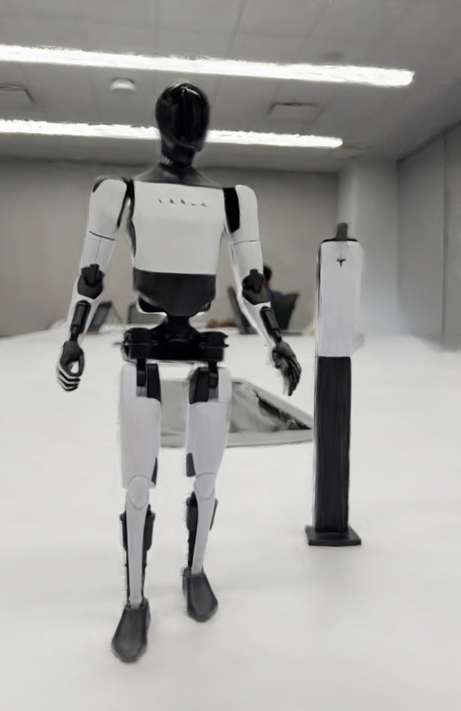 |
